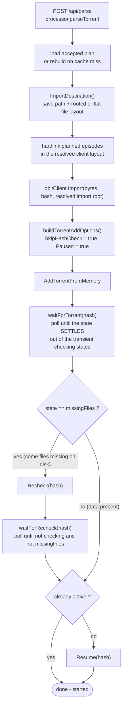
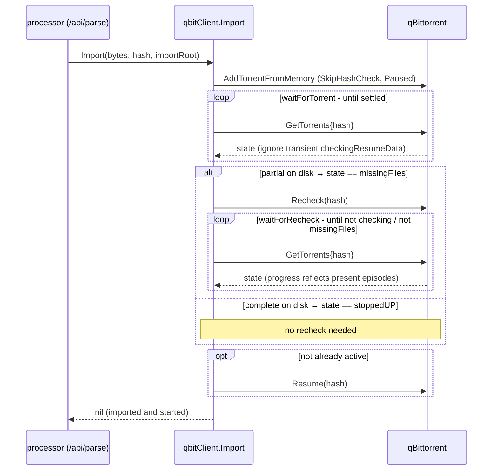

# qBittorrent import flow (`/api/parse`)

How `/api/parse` re-imports a matched season pack into qBittorrent, and how the
same code path behaves when the pack is **complete on disk** (every episode was
already hardlinked) versus **partial on disk** (only some episodes were present,
the rest still need downloading - the normal seasonpackarr case).

See [season-pack-lifecycle.md](season-pack-lifecycle.md) for the end-to-end
request flow; this doc zooms into the client-side import handled by
`internal/torrentclient` (`qbitClient.ImportDestination` / `qbitClient.Import`).
The Transmission and Deluge adapters reach the same outcome differently. See
[the client contrasts below](#transmission-contrast).

## The algorithm

The processor resolves the destination, hardlinks the episodes it already has,
then hands the pack to the client adapter. The adapter adds the torrent with the
hash check skipped (the present files are already in place), lets qBittorrent
recheck if it reports missing files, and resumes it.



Any step that fails returns a stage-tagged `*ImportError` (`config` / `add` /
`find` / `recheck` / `resume`) which the processor maps to a status code
(459–463) without ever seeing a qBittorrent type.

Category-only policy sends the category without `savepath` or `autoTMM`, so
qBittorrent keeps its own path-selection and automatic-management behavior.
Before creating hardlinks, seasonpackarr reads the same global Auto TMM and
manual category-path preferences to select the destination qBittorrent will use.
An explicit save or download path also sends the resolved final save path,
which opts that torrent out of Auto TMM.

## Complete vs partial, step by step



The single difference between the two runs is whether the added torrent lands in
`missingFiles`, which is driven entirely by what is present on disk:

| | **complete on disk** | **partial on disk** |
| --- | --- | --- |
| step 3 hardlink | every episode lands in the resolved rooted or flat layout | only the episodes we already had |
| add (skip-check, paused) | qBittorrent trusts it is complete | qBittorrent trusts it is complete |
| `waitForTorrent` settles to | `stoppedUP` (100%) | `checkingResumeData` (misleading 100%) → **`missingFiles`** (0%) |
| `missingFiles` branch | skipped | **`Recheck` → `waitForRecheck`** → `stoppedDL` at ~0.33 |
| resume decision | not active → **`Resume`** | not active → **`Resume`** |
| **final state (live-observed)** | **`stalledUP`, progress `1.00`** - seeding, nothing downloaded | **`stalledDL`, progress `0.33`** - downloading only the missing episodes |

(The `stalled*` states just mean "no peers" in the test rig; against a live
swarm the partial torrent is `downloading`.)

## Why `waitForTorrent` waits for the state to *settle*

This is the load-bearing detail. On a **paused, skip-check** add, qBittorrent
does not report `missingFiles` immediately. Observed against qBittorrent 5.x with
one of three episodes present:

```
poll[00] state=checkingResumeData progress=1.00   <- misleading: skip-check assumed complete
poll[01] state=checkingResumeData progress=1.00
...
poll[06] state=missingFiles       progress=0.00   <- the truth, ~1.5s later
```

An earlier version returned on the torrent's **first appearance**, caught it in
`checkingResumeData`, concluded "not `missingFiles`", skipped the recheck, and
resumed straight into an errored `missingFiles` torrent that never downloaded.
`waitForTorrent` therefore polls until the state leaves the transient checking
set (`isCheckingState`: `checkingResumeData`, `checkingDL`, `checkingUP`,
`moving`, `allocating`) before deciding. Regression-guarded by
`TestQbitImportWaitsForCheckingToSettle` (unit) and `TestQbitImportPartialLive`
(live).

## Always added stopped, always started

The torrent is **always added stopped** so the recheck happens before anything
runs, and a correctly imported torrent is **always started** once its data has
been accounted for - it is never left stopped. The only reason `Import` skips
the final `Resume` is if the torrent is already active (`isActiveTorrentState`),
which is a no-op anyway. There is no config knob for this: leaving a correct
import stopped is never desired, and adding it un-stopped would race the recheck.

## Transmission contrast

Transmission has no skip-hash-check in its RPC (verified against 4.0.6 and
4.1.3), so the adapter cannot "trust complete then recheck". Instead it adds
stopped, forces a `TorrentVerify`, polls until the check leaves the checking
states, then starts. The outcome matches qBittorrent: complete → seeding at
`percentDone 1.00`; partial → `percentDone 0.33`, downloading only the missing
episodes.

## Deluge contrast

Deluge 1.3 and 2 receive the torrent through their version-specific native
daemon RPC protocols with `add_paused` and an explicit `download_location`.
The adapter adds the torrent paused, applies its optional label, then resumes
it into Deluge/libtorrent's normal initial check. It polls until the torrent is
no longer paused, checking, allocating, or moving. Environment-gated live tests
against Deluge 1.3.15 and 2.1.2 verify that complete packs seed and partial
packs account for present bytes before they download missing pieces. The tests
require externally managed daemons and are not part of CI. The adapter currently
requires a v1 or hybrid torrent because seasonpackarr uses the legacy info hash
as the daemon torrent ID.
