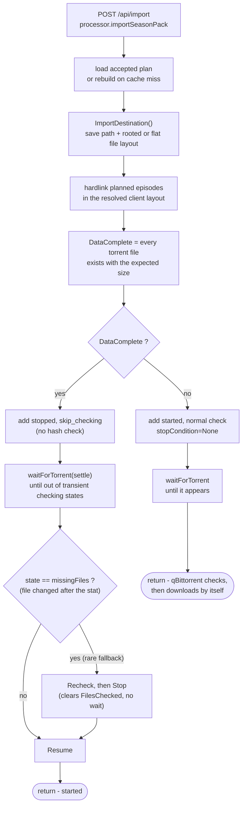

# qBittorrent import flow (`/api/import`)

How `/api/import` re-imports a matched season pack into qBittorrent, and how the
same code path behaves when the pack is **complete on disk** (every torrent
file was already hardlinked) versus **partial on disk** (only some episodes were
present, the rest still need downloading - the normal seasonpackarr case).

See [season-pack-lifecycle.md](season-pack-lifecycle.md) for the end-to-end
request flow; this doc zooms into the client-side import handled by
`internal/torrentclient` (`qbitClient.ImportDestination` / `qbitClient.Import`).
The Transmission and Deluge adapters reach the same outcome differently. See
[the client contrasts below](#transmission-contrast).

## The client owns the data check

`Import` returns as soon as the client has the torrent. It never waits for a
hash check. autobrr gives a Webhook action a fixed 120-second limit
([audit](../references/autobrr-timeout-audit.md)), and a check of a large
partial pack can take longer. On 2026-10-07 a 9-of-10 episode 1080p pack
needed about 2 minutes 50 seconds. autobrr cancelled the request in the middle
of the old recheck wait, and qBittorrent left the torrent stopped after its
check until a manual start.

The processor also calls `Import` with a context that the HTTP caller cannot
cancel, so a disconnect cannot interrupt a started client mutation. Each
adapter bounds its own client calls.

## The algorithm

The processor resolves the destination and hardlinks the episodes it already
has. Then it sets `ImportRequest.DataComplete`: true only when every torrent
file (except BEP 47 padding files) exists at its import target with the
expected size. The qBittorrent adapter uses that value to choose the add mode.
The hardlinker reuses only `.mkv` and `.mp4` files, so a pack that also holds
an `.nfo`, subtitles, or a sample is partial even when every episode is on
disk. A skip-check add of such a pack would mark the missing files complete,
so it gets a normal check instead, as it did with the old recheck flow.


```mermaid
flowchart TD
    A["POST /api/import<br/>processor.importSeasonPack"] --> B["load accepted plan<br/>or rebuild on cache miss"]
    B --> C["ImportDestination()<br/>save path + rooted or flat file layout"]
    C --> D["hardlink planned episodes<br/>in the resolved client layout"]
    D --> E["DataComplete = every torrent file<br/>exists with the expected size"]
    E --> F{"DataComplete ?"}
    F -- "yes" --> G["add stopped, skip_checking<br/>(no hash check)"]
    G --> H["waitForTorrent(settle)<br/>until out of transient checking states"]
    H --> I{"state == missingFiles ?<br/>(file changed after the stat)"}
    I -- "yes (rare fallback)" --> J["Recheck, then Stop<br/>(clears FilesChecked, no wait)"]
    I -- "no" --> K["Resume"]
    J --> K
    F -- "no" --> L["add started, normal check<br/>stopCondition=None"]
    L --> M["waitForTorrent<br/>until it appears"]
    M --> N(["return - qBittorrent checks,<br/>then downloads by itself"])
    K --> O(["return - started"])
```

Every return includes a neutral `ImportReport` with attempted stage durations.
Any step that fails also returns a stage-tagged `*ImportError` (`config` /
`add` / `find` / `recheck` / `resume`) which the processor maps to a status
code (459-463) without ever seeing a qBittorrent type. The processor logs the
report and `data_complete`, so an operator can see which add mode ran and
where the time went.

Category-only policy sends the category without `savepath` or `autoTMM`, so
qBittorrent keeps its own path-selection and automatic-management behavior.
Before creating hardlinks, seasonpackarr reads the same global Auto TMM and
manual category-path preferences to select the destination qBittorrent will use.
An explicit save or download path also sends the resolved final save path,
which opts that torrent out of Auto TMM.

## Complete vs partial

| | **complete on disk** | **partial on disk** |
| --- | --- | --- |
| hardlinks | every torrent file is present with the expected size | only the episodes we already had |
| add | `skip_checking`, stopped | normal check, `stopped=false`, `stopCondition=None` |
| hash check | none | qBittorrent checks the present data after `Import` returns |
| `Import` waits for | the state to settle (about 1 second) | the torrent to appear (milliseconds) |
| start | `Resume` | qBittorrent starts it after its check |
| **final state (daemon-observed)** | **`stalledUP`, progress `1.00`** | **`stalledDL`, progress `0.75`** for 3 of 4 episodes |

(The `stalled*` states just mean "no peers" in the test rig; against a real
swarm the partial torrent is `downloading`.)

Verified on 2026-10-07 against qBittorrent 4.3.9, 4.4.5, 4.5.5, 4.6.7, 5.0.5,
5.1.4, and 5.2.3 (WebAPI 2.8.2 to 2.15.1). With a 2 GiB pack, a category, and
Auto TMM, every version returned a partial `Import` in 2-255 ms while it was
still checking, with the first or the last episode missing. Complete packs
took 0.26-1.5 seconds with no hash check. qBittorrent before 4.5 ignores the
`stopped` and `stopCondition` add parameters and honors `paused=false`; the
global "start paused", "add stopped", and "stop after files checked"
preferences did not stop an import on any version. On 4.3.9 and 5.1.4 a real
peer then supplied the missing episode, the torrent seeded at 100%, and the
reused episodes stayed hardlinks of their sources.

A 2 GiB pack against qBittorrent 5.1.4: the partial `Import`
returned in 4-256 ms while qBittorrent was still checking. The check finished
about 2 seconds later. The result was the same with an explicit save path, an
explicit download path, and a category with Auto TMM, and also with the global
"add stopped" and "stop after files checked" preferences enabled. Through the
HTTP API on a Linux volume, a partial `/api/import` took 0.1-0.4 seconds with
this design and 4.4 seconds with the old recheck wait.

Two qBittorrent behaviors after the check of a partial pack also applied to the
old recheck flow:

- With a download path (category or global temporary path), qBittorrent moves
  the incomplete torrent there after the check. On the same file system this
  is a rename that keeps the hardlinks; across file systems it copies the data.
- With "append .!qB extension to incomplete files", qBittorrent renames files
  that are not complete yet. A hardlinked episode whose edge pieces are shared
  with a missing episode keeps that suffix until the pack finishes. The source
  episode is not changed.

## Why a partial pack does not use skip-check and recheck

qBittorrent has no option to trust only the files that are present. A
skip-check add puts the torrent in libtorrent seed mode. When a file is
missing, the fast resume data is rejected and the torrent goes to
`missingFiles`. Two ways out of that state do not work without a wait:

- `start` on a `missingFiles` torrent reloads it with the same seed-mode
  parameters, and it returns to `missingFiles`.
- `recheck` on a stopped torrent sets the `FilesChecked` stop condition, so the
  torrent stops again after the check. A `start` during the check does not
  clear that condition.

Both were observed against qBittorrent 5.1.4 and match
`TorrentImpl::forceRecheck`, `TorrentImpl::start`, and
`TorrentImpl::handleTorrentCheckedAlert` in its source. A normal started add
avoids `missingFiles` entirely and needs no further API calls. The partial data
must be hashed in every design, so this costs no extra disk reads.

## Why the complete path waits for the state to *settle*

On a **stopped, skip-check** add, qBittorrent does not report `missingFiles`
immediately. Observed against qBittorrent 5.x with one of three episodes
present:

```
poll[00] state=checkingResumeData progress=1.00   <- misleading: skip-check assumed complete
poll[01] state=checkingResumeData progress=1.00
...
poll[06] state=missingFiles       progress=0.00   <- the truth, ~1.5s later
```

An earlier version returned on the torrent's **first appearance**, caught it in
`checkingResumeData`, concluded "not `missingFiles`", skipped the recheck, and
resumed straight into an errored `missingFiles` torrent that never downloaded.
For a complete pack, `waitForTorrent` therefore polls until the state leaves the
transient checking set (`isCheckingState`: `checkingResumeData`, `checkingDL`,
`checkingUP`, `moving`, `allocating`).

If a file changes after the processor checked it, the complete path can still
see `missingFiles`. The fallback calls `recheck`, then `stop`, then `start`
without a wait: `stop` is the only call that clears the `FilesChecked` stop
condition that `recheck` sets on a stopped torrent (qBittorrent 4.6 and 5.x;
older releases resume the torrent after the check without that condition).
`TestQbitDaemon_RecoversMisclassifiedCompletePack` pins this against a real
daemon; without the `stop` call the torrent ends at `stoppedDL`.
Regression-guarded by `TestQbitImport_WaitsForCheckingToSettle` (unit) and
`TestQbitDaemon_ImportsCompletePack` (real daemon).

A partial pack must not settle: its check can take longer than the request
timeout. `TestQbitImport_PartialPackReturnsWhileChecking` (unit) and
`TestQbitDaemon_ResumesPartialPack` (real daemon) guard that path.

## Always started

A correctly imported torrent is never left stopped. A complete pack is resumed
after it settles; `Import` skips `Resume` only when the torrent is already
active. A partial pack is added started with `stopCondition=None`, which
overrides qBittorrent's global "add stopped" and stop-condition preferences.
If qBittorrent still reports a stopped partial pack, `Import` resumes it.

## Transmission contrast

Transmission has no skip-hash-check RPC option (verified against 4.0.6 and
4.1.3), but its add path owns the check. The adapter adds the torrent started
and returns without a forced verify:

- When every file exists with the expected size, has no `.part` suffix, and has
  an mtime older than the add, and the first piece verifies, Transmission makes
  the new torrent a seed without a full verify (`isNewTorrentASeed` /
  `is_new_torrent_a_seed`, with the default `torrent-added-verify-mode` of
  `fast`). Hardlinks keep the source file's mtime, so complete packs qualify.
- Otherwise Transmission verifies the data and then starts the torrent because
  it was added started (`start_when_stable`). A `start` during the verify is
  deferred until the verify is done.

A 2 GiB pack on 2026-10-07: complete packs were seeding 10-13 ms after the
add with no verify; partial packs returned in 2-5 ms, verified, and then
downloaded at `percentDone 0.75`. The same results held with
`incomplete-dir-enabled` and `start-added-torrents` off. When the first file
is missing, Transmission keeps the torrent's current folder in the incomplete
folder, but it still finds the hardlinked episodes in the download folder. A
real peer then supplied the missing episode; at completion every file was in
the download folder and the reused episodes stayed hardlinks of their
sources. `TestTransmissionDaemon_ResumesPartialPackWithIncompleteDir` covers the check
against a real daemon. The old adapter forced a verify, which
defeated the seed shortcut for complete packs. Transmission ignores BEP 47
padding attributes, so a hybrid torrent with padding files never qualifies for
the shortcut and always gets a verify.

## Deluge contrast

Deluge 1.3 and 2 receive the torrent through their version-specific native
daemon RPC protocols with `add_paused` and an explicit `download_location`.
The adapter adds the torrent paused, applies its optional label, then resumes
it. libtorrent checks the present data, so Deluge always pays one
client-owned check. The adapter waits only until the torrent is no longer
paused. A checking torrent counts as started because libtorrent continues into
the transfer after its check.

The adapter does not use Deluge 2 `seed_mode`. When libtorrent rejects a
seed-mode add because a file is short or missing, Deluge 2.1 handles the
`fastresume_rejected` alert with a forced error state that `resume` cannot
clear (`torrentmanager.py` `on_alert_fastresume_rejected`). A misclassified
pack would stay in an error state instead of downloading.

A 2 GiB pack on 2026-10-07: complete and partial packs on Deluge 2.1.2 and
1.3.15 returned in 8-316 ms while Deluge was checking, then seeded or
downloaded at 75%. Tagged integration tests against Deluge 1.3.15, 2.0.3 and
2.2.0 verify that complete packs seed and partial packs account for present
bytes before they download missing pieces. The harness and the integration
workflow run them. The adapter currently requires a v1 or hybrid
torrent because seasonpackarr uses the legacy info hash as the daemon torrent
ID.
