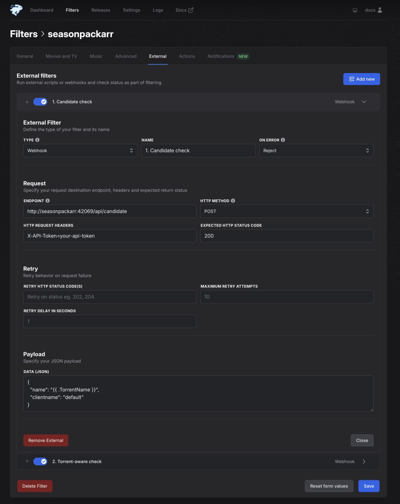
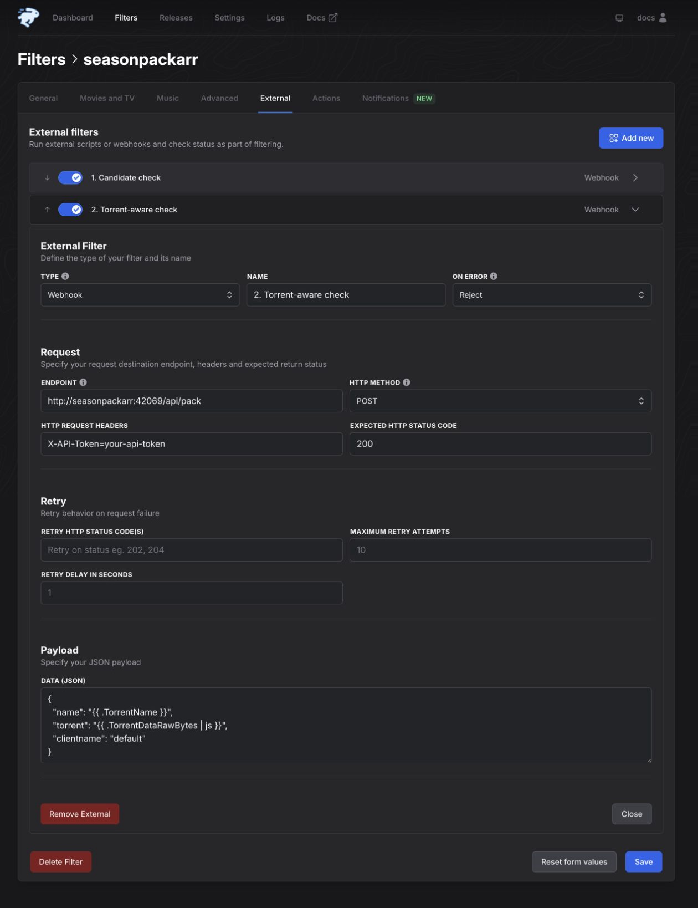
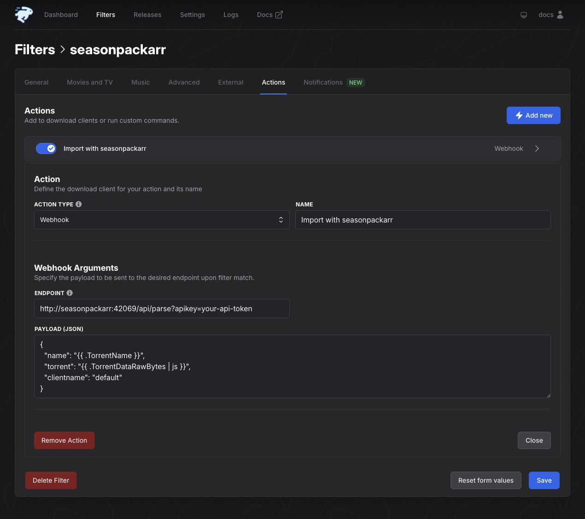

# Upgrade from v0.16.0 to v1.0.0

Use this guide when you upgrade an existing seasonpackarr installation from
v0.16.0 to v1.0.0. New installations can follow the main README instead.

This upgrade needs changes in two places:

1. your seasonpackarr configuration
2. your seasonpackarr filter in autobrr

Plan a short maintenance window. Keep the autobrr filter disabled until both
parts are complete.

## What changes in v1.0.0

- Torrent parsing is always enabled.
- Autobrr runs a quick check before it downloads the torrent file. It runs a
  second, exact check only when the first check passes.
- seasonpackarr adds the accepted torrent to your torrent client. Autobrr must
  not add the same torrent separately.
- Smart mode measures how much of the announced torrent can be reused. It no
  longer asks TVDB or TVMaze for the season episode count.

There is no database migration. Existing torrent data does not need to move if
the new import destination points to the same location.

## Before you start

1. Disable the seasonpackarr filter in autobrr.
2. Export the filter or take screenshots of its current External and Actions
   tabs.
3. Back up your seasonpackarr configuration and Docker Compose file, if used.
4. Open the old torrent-client action in autobrr. Record its save path,
   category, tags, incomplete-download path, and content layout.
5. Record the old `preImportPath` for each client in seasonpackarr.

If the old `preImportPath` and the Autobrr action save path are different,
decide which final destination the torrent client must use after the upgrade.
The new configuration uses one destination for both the hardlinks and the
imported torrent.

## 1. Update the seasonpackarr configuration

### Remove old settings

Remove these settings from `config.yaml`, even if they are empty:

| Remove | Why |
| --- | --- |
| `parseTorrentFile` | Torrent parsing is now always enabled. |
| the complete `metadata` section | Smart mode no longer uses TVDB or TVMaze. |
| `clients.<name>.preImportPath` | The new `import` section replaces it. |

seasonpackarr will not start while these old settings are present. If one of
them is not in your configuration, you do not need to add or change it.

### Add an import section for qBittorrent

Copy the settings that you recorded from the old Autobrr qBittorrent action.
For example:

```yaml
clients:
  default:
    type: qbittorrent
    host: 127.0.0.1
    port: 8080
    username: admin
    password: change-me
    import:
      savePath: /data/torrents/tv-hd
      category: tv-hd
      tags: [seasonpackarr]
      # downloadPath: /data/torrents/incomplete
      # contentLayout: subfolder
```

A qBittorrent client needs `savePath`, `category`, or both:

- Use `savePath` when you want to set the final folder directly.
- Use `category` when qBittorrent already selects the correct folder from its
  category and Automatic Torrent Management settings.
- Use both when your existing setup already depends on both values.

Do not copy the example paths without checking them. Use the paths that your
seasonpackarr and qBittorrent containers or services can both see.

### Add an import section for Transmission

Copy the save path and labels from the old Autobrr Transmission action. For
example:

```yaml
clients:
  default:
    type: transmission
    host: 127.0.0.1
    port: 9091
    username: transmission
    password: change-me
    import:
      savePath: /data/torrents/tv-hd
      tags: [seasonpackarr]
```

If `savePath` is empty, seasonpackarr uses Transmission's default download
folder. Transmission does not support `category`, `downloadPath`, or
`contentLayout`.

### Check other settings from the old action

- The old **Skip Hash Check** rule does not move to the new configuration.
  seasonpackarr now controls the data check before it starts the torrent.
- A setting that left accepted torrents paused has no direct replacement.
  v1.0.0 adds the torrent stopped, checks its data, and then starts it.
- Move any other client-specific rules to the torrent client's defaults or to
  separate client-side automation.

### Check paths and permissions

Before you start v1.0.0, confirm all of the following:

- A configured `savePath` already exists.
- seasonpackarr can write to that folder.
- seasonpackarr and the torrent client see the same data under compatible
  paths.
- The existing episode files and the target folder are on the same filesystem.
  Hardlinks do not work across filesystems.
- The configured torrent-client account can add, check, and start torrents.

Container paths are the paths inside the containers. They do not have to match
the host path, but seasonpackarr and the torrent client must agree on the path
that the torrent client receives.

<details>
<summary>Environment-only and Docker Compose configuration</summary>

Remove these old variables:

```text
SEASONPACKARR__PARSE_TORRENT_FILE
SEASONPACKARR__METADATA_TVDB_API_KEY
SEASONPACKARR__METADATA_TVDB_PIN
SEASONPACKARR__CLIENTS_<NAME>_PREIMPORTPATH
```

Use these variables for the new import settings:

```text
SEASONPACKARR__CLIENTS_<NAME>_TYPE
SEASONPACKARR__CLIENTS_<NAME>_IMPORT_SAVE_PATH
SEASONPACKARR__CLIENTS_<NAME>_IMPORT_TAGS
SEASONPACKARR__CLIENTS_<NAME>_IMPORT_CATEGORY
SEASONPACKARR__CLIENTS_<NAME>_IMPORT_DOWNLOAD_PATH
SEASONPACKARR__CLIENTS_<NAME>_IMPORT_CONTENT_LAYOUT
```

Replace `<NAME>` with the upper-case client name used by your other variables,
for example `DEFAULT`. `IMPORT_TAGS` is a comma-separated list. Category,
download path, and content layout are qBittorrent-only settings.

Run `docker compose config` before the upgrade if you use Compose. Check the
resolved environment variables and volume paths.

</details>

## 2. Update the autobrr filter

The screenshots below use Autobrr 1.83.0. A different Autobrr version can look
slightly different, but the field names and values are the same.

In every example:

- replace `seasonpackarr` with the host or IP address that Autobrr uses to
  reach seasonpackarr
- replace `your-api-token` with your seasonpackarr API token
- replace `default` with your seasonpackarr client name, if you use another
  name

If API authentication is disabled in seasonpackarr, leave the header empty and
omit `?apikey=...` from the action endpoint.

v1.0.0 uses standard HTTP status codes. A successful check returns `200`.
Autobrr rejects any other result because **On Error** is set to **Reject** and
the expected status is `200`.

For troubleshooting, `400` means that the request is invalid, `422` means that
the release was rejected by matching or smart-mode policy, `500` means that
seasonpackarr failed internally, and `502` means that a torrent-client
operation failed. The response body includes a named reason and a message.

### External entry 1: quick candidate check

Open the filter's **External** tab, select **Add new**, and choose **Webhook**.
Enter:

| Field | Value |
| --- | --- |
| Name | `1. Candidate check` |
| On Error | `Reject` |
| Endpoint | `http://seasonpackarr:42069/api/candidate` |
| HTTP method | `POST` |
| HTTP Request Headers | `X-API-Token=your-api-token` |
| Expected HTTP status code | `200` |

Use this in **Data (JSON)**:

```json
{
  "name": "{{ .TorrentName }}",
  "clientname": "default"
}
```

Enable the entry. This check uses only the announce name. A rejection stops
the filter before Autobrr downloads the torrent file.



### External entry 2: exact torrent check

Select **Add new** again and choose **Webhook**. Enter:

| Field | Value |
| --- | --- |
| Name | `2. Torrent-aware check` |
| On Error | `Reject` |
| Endpoint | `http://seasonpackarr:42069/api/pack` |
| HTTP method | `POST` |
| HTTP Request Headers | `X-API-Token=your-api-token` |
| Expected HTTP status code | `200` |

Use this in **Data (JSON)**:

```json
{
  "name": "{{ .TorrentName }}",
  "torrent": "{{ .TorrentDataRawBytes | js }}",
  "clientname": "default"
}
```

Enable the entry. This check downloads and reads the torrent only after the
quick check passes. It decides whether the pack is useful, but it does not add
the torrent or create files.



### Confirm the External order

The order must be:

1. `1. Candidate check`
2. `2. Torrent-aware check`

Autobrr shows the reorder arrows only after the filter has more than one
External entry. Use those arrows if needed. Save the filter, reload the page,
and confirm that the candidate check is still first. Autobrr runs the entries
from top to bottom.

### Replace the old torrent-client action

Open the filter's **Actions** tab.

1. Remove the old qBittorrent or Transmission action. seasonpackarr now adds
   the torrent itself. Leaving the old action in place can add the torrent
   twice.
2. Keep the existing `/api/parse` Webhook action, or add one if torrent parsing
   was disabled before the upgrade.
3. Make sure it is the only action that adds or sends this torrent.

Enter:

| Field | Value |
| --- | --- |
| Action type | `Webhook` |
| Name | `Import with seasonpackarr` |
| Endpoint with API authentication | `http://seasonpackarr:42069/api/parse?apikey=your-api-token` |
| Endpoint without API authentication | `http://seasonpackarr:42069/api/parse` |

Use this in **Payload (JSON)**:

```json
{
  "name": "{{ .TorrentName }}",
  "torrent": "{{ .TorrentDataRawBytes | js }}",
  "clientname": "default"
}
```

The Autobrr Webhook Action form does not have a request-header field. When API
authentication is enabled, put the token in the endpoint as shown above.



Save the filter, but keep it disabled until seasonpackarr v1.0.0 is running.

## 3. Start v1.0.0 and check the setup

1. Install the v1.0.0 binary or container image.
2. Start seasonpackarr while the Autobrr filter is disabled.
3. Check the seasonpackarr log. If it reports an old setting, remove that
   setting and start the service again.
4. Open `http://host:port/api/healthz/readiness` in a browser. A ready service
   returns `OK`.
5. Reload the Autobrr filter and confirm the External order one more time.
6. Enable the filter.
7. Observe one controlled season-pack match. Confirm that:
   - Autobrr runs both External checks in the correct order.
   - Only one torrent is added to the client.
   - Existing episodes appear as hardlinks in the season-pack folder.
   - The torrent finishes its check and starts.
   - Only missing data downloads.

Do not repeatedly send the same match while the torrent client is still
checking it.

<details>
<summary>Optional command-line checks before enabling the filter</summary>

Test the quick check with a representative release name:

```bash
seasonpackarr test candidate "Series.S01.1080p.WEB-DL.H.264-RlsGrp" \
  --client default --host 127.0.0.1 --port 42069 --api your-api-token
```

Test the exact, read-only check with a representative torrent file:

```bash
seasonpackarr test pack "/path/to/Series.S01.torrent" \
  --client default --host 127.0.0.1 --port 42069 --api your-api-token
```

Do not use `seasonpackarr test parse` as a read-only test. It creates hardlinks
and adds the torrent to the client.

</details>

## Review smart mode after the upgrade

The `smartModeThreshold` number uses the same range, but it now answers a more
direct question: how much of this specific torrent can seasonpackarr reuse?

For example, if the torrent contains 12 episode files and seasonpackarr can
reuse 8 of them, coverage is `8 / 12 = 0.67`. A threshold of `0.75` rejects
that pack.

Coverage includes MKV and MP4 files that parse as episodes. Samples and extra
videos do not count.

If file linking later succeeds for too few episodes, seasonpackarr does not
import the torrent. Links that it already created stay in place. seasonpackarr
does not delete them automatically because that could remove files that belong
to another application.

Partial-season packs, specials, and torrents with unusual file layouts can now
produce a different result than v0.16.0. Review the first few representative
matches and adjust the threshold only if the new result does not fit your
preference.

## If the parse action times out

Autobrr waits 120 seconds for a Webhook action. `/api/parse` waits while the
torrent client checks the available data, and a large or slow check can take
longer with qBittorrent, Transmission, or Deluge.

An Autobrr timeout does not necessarily mean that the import stopped. Before
you retry:

1. check the seasonpackarr log
2. check whether the torrent already exists in the client
3. wait for any active data check to finish

This avoids adding or processing the same torrent again while the first import
is still running.

## Roll back to v0.16.0

1. Disable the Autobrr filter.
2. Stop v1.0.0.
3. Restore the v0.16.0 binary or image and your backed-up v0.16.0
   configuration.
4. Restore the old Autobrr filter. It must have the single `/api/pack`
   External check and the old torrent-client action. If the restored v0.16.0
   configuration uses `parseTorrentFile`, also restore its `/api/parse`
   Webhook action above the torrent-client action. The restored External entry
   must expect the v0.16.0 status `250`, not the v1.0.0 status `200`.
5. Start v0.16.0, check that it is healthy, and enable the restored filter.

Rollback does not remove hardlinks or torrents already imported by v1.0.0.
Inspect those items before the restored filter processes another announce.

## New options that do not require migration

- v1.0.0 adds Deluge 1.3 and Deluge 2 support. Existing qBittorrent and
  Transmission users do not need to change client type.
- More settings reload after a valid configuration edit. Server host and port,
  log-file settings, and `disableConfigFile` still require a restart.
